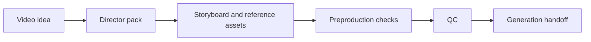

# Storyboard Driven AI Video

Storyboard Driven AI Video is a set of Codex skills and Python scripts for **AI video preproduction**. It turns a plain video idea into a controllable director pack: storyboard structure, control strategy, reference asset roles, QC reports, and a generation handoff for downstream video models or agents.

This project does not render final videos. It focuses on the part that usually determines whether a video generation succeeds: **define how the video should be controlled before asking a model to generate it.**

Chinese documentation: [README.md](README.md)

## Why This Exists

Direct video prompts often fail in predictable ways:

- A character, product, or prop changes between shots.
- A storyboard becomes a nice image but does not control shot order, motion, or timing.
- Character, prop, environment, and style references are mixed together, so the model cannot tell what each image should control.
- Upload prompts accidentally include local paths, storyboard borders, arrows, labels, or other artifacts that should not appear in the final video.
- Expensive generation starts before there is a readiness check.

This repository breaks that work into a reviewable pipeline:



## What Is Included

- `skills/storyboard-video-director/`  
  Builds storyboard-first director packs from plain-language briefs.

- `skills/storyboard-video-qc/`  
  Reviews packs before video generation.

- `scripts/run_regression.py`  
  Runs the public smoke/regression suite.

- `examples/fan_kata_minimal/`  
  A minimal public fixture showing the pack structure, reference asset roles, and final handoff.

- `docs/`  
  Workflow, QC policy, release boundary, and reproduction notes.

## Quick Start

Requires Python 3.10+. The core scripts use the standard library; `Pillow` is optional and only improves image dimension checks.

```powershell
python scripts\run_regression.py
```

Expected output:

```text
Regression passed.
- examples\fan_kata_minimal
- product-lock prompt-only negative fixture
- high-motion storyboard prompt-only negative fixture
- SVG-only storyboard negative fixture
```

Run the final preproduction chain for the public fixture:

```powershell
python skills\storyboard-video-director\scripts\preproduction_orchestrator.py examples\fan_kata_minimal --phase final
```

Expected generated outputs:

- `examples/fan_kata_minimal/16_preproduction_orchestrator_report.md`
- `examples/fan_kata_minimal/17_generation_handoff/asset_manifest.json`
- `examples/fan_kata_minimal/17_generation_handoff/video_prompt_for_upload.txt`
- `examples/fan_kata_minimal/17_generation_handoff/handoff_readiness_report.md`

## Create a Pack

Start from a plain brief:

```powershell
python skills\storyboard-video-director\scripts\create_pack_from_brief.py --brief "A 12-second fantasy clip: in an old library, a girl opens a book, pages spiral around her, and her coat turns into a glowing cloak. The transformation should be driven by her motion, not random magic. End with the cloak settling into a steady final pose."
```

Then run preflight:

```powershell
python skills\storyboard-video-director\scripts\preproduction_orchestrator.py <pack_dir> --phase preflight
```

Use final phase before real or expensive generation:

```powershell
python skills\storyboard-video-director\scripts\preproduction_orchestrator.py <pack_dir> --phase final
```

## Delivery Levels

- `iteration`: text planning and image-generation tasks for early drafts.
- `preflight`: normal short-video/product-video readiness; required control assets must exist.
- `final`: production handoff with strict asset checks and `17_generation_handoff/`.

For videos where a product, prop, character, or object must stay consistent, files such as `prop_reference`, `character_reference`, and `storyboard_control` are control assets, not decoration.

## Reference Asset Roles

- `storyboard_control`: shot order, action path, timing, composition, and camera movement.
- `character_reference`: identity, proportions, costume, face, and body language.
- `prop_reference`: product/prop silhouette, scale, material, moving parts, and forbidden mutations.
- `environment_reference`: geography, landmarks, lighting, and spatial continuity.
- `style_reference`: render finish, line quality, palette, and lens tone.
- `clean_keyframe_reference`: clean final-frame targets without arrows, labels, borders, text, or UI.

## Use the Outputs With Video Tools

The `17_generation_handoff/` folder produced by `--phase final` is the boundary for downstream video generation. The same handoff pattern works for XYQ / Xiao Yun Que agents, Jimeng, Seedance2-style tools, or other video platforms that support image references:

1. Open `17_generation_handoff/handoff_readiness_report.md` and make sure the verdict is `READY`.
2. Upload only the image files listed in `17_generation_handoff/asset_manifest.json`.
3. Keep each uploaded image mapped to its role, such as `@storyboard_control`, `@character_reference`, or `@prop_reference`.
4. Use `17_generation_handoff/video_prompt_for_upload.txt` as the main video prompt.
5. In the target tool, keep the Segment duration and order from the director pack. For Seedance2-style generation, one Segment should normally stay within the 5-15 second range.

The key rule is to keep reference roles separate. Do not treat every image as a generic style reference. `storyboard_control` controls camera and action; `character_reference` controls identity; `prop_reference` controls the object or product; `style_reference` controls finish and look.

For an XYQ / Xiao Yun Que agent workflow, create a starter agent manifest:

```powershell
python skills\storyboard-video-director\scripts\build_xyq_video_task.py <pack_dir> --init-manifest
```

Upload the images listed in `13_xyq_video_handoff/asset_manifest.json`, fill in the returned `asset_id` values, then build the agent task message:

```powershell
python skills\storyboard-video-director\scripts\build_xyq_video_task.py <pack_dir>
```

For Jimeng or other web video tools, you usually do not need an `asset_id` file. Upload the images from `17_generation_handoff/asset_manifest.json` and paste `video_prompt_for_upload.txt`. The final video should not render storyboard borders, arrows, panel numbers, labels, notes, UI, or watermarks; those are control artifacts only.

## Use With Codex

The repository contains standard Codex skill folders. Install or load `skills/storyboard-video-director/` and `skills/storyboard-video-qc/` according to your Codex environment.

Example prompts:

```text
Use $storyboard-video-director to turn this idea into a storyboard-driven director pack.
```

```text
Use $storyboard-video-qc to review whether this pack is ready for video generation.
```

## Open-Source Boundary

The public repository should contain only reproducible code, docs, and examples. Do not commit private learning packs, local outputs, upload IDs, API keys, or assets whose redistribution rights are unclear.

Before publishing changes:

```powershell
python scripts\check_open_source_readiness.py --allow-placeholder-images
```

See also:

- [docs/publication_manifest.md](docs/publication_manifest.md)
- [docs/open_source_release_checklist.md](docs/open_source_release_checklist.md)

## Version

Current release:

```text
0.1.0-alpha
```

Check version consistency:

```powershell
python scripts\check_skill_versions.py --no-installed --package-dir examples\fan_kata_minimal
```

## Status

This is an alpha-stage project. The pack structure, validators, and handoff pipeline are script-testable. Actual storyboard image generation, reference asset generation, and final video generation still depend on external image/video model tools.
