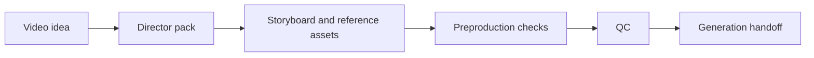

# Storyboard Driven AI Video

Storyboard Driven AI Video 是一套用于 **AI 视频预生产** 的 Codex skills 和脚本。它帮助你把一句视频想法整理成可执行的导演包：分镜节奏、控制策略、参考资产、质检报告，以及给视频模型或视频 agent 使用的最终 handoff。

这个项目不负责直接生成最终视频。它关注的是生成前最容易被忽略、却最影响成片稳定性的部分：**先把视频怎么拍说清楚，再让模型去生成。**

English: [README.en.md](README.en.md)

## 为什么需要它

直接写一个视频 prompt 往往会遇到这些问题：

- 角色或产品在镜头之间变样。
- 故事板只是一张参考图，没有真正控制镜头顺序、动作路径和节奏。
- 角色、道具、环境、风格参考混在一起，模型不知道每张图该控制什么。
- 下游 prompt 带入本地路径、故事板边框、箭头、标签或其他不该出现在最终视频里的信息。
- 进入昂贵的视频生成前，没有明确的 readiness 检查。

本项目把这些问题拆成一个可检查的流程：



## 仓库内容

- `skills/storyboard-video-director/`  
  将普通语言的视频想法整理成 storyboard-first director pack。

- `skills/storyboard-video-qc/`  
  在视频生成前检查导演包是否足够稳定。

- `scripts/run_regression.py`  
  公开回归测试，验证核心流程仍然可运行。

- `examples/fan_kata_minimal/`  
  一个最小公开样例，用来展示目录结构、参考资产角色和 final handoff。

- `docs/`  
  工作流、质检策略、发布边界和复现用例说明。

## 快速试跑

需要 Python 3.10+。核心脚本只使用标准库；`Pillow` 是可选依赖，用于更细的图片尺寸检查。

```powershell
python scripts\run_regression.py
```

预期输出：

```text
Regression passed.
- examples\fan_kata_minimal
- product-lock prompt-only negative fixture
- high-motion storyboard prompt-only negative fixture
- SVG-only storyboard negative fixture
```

你也可以单独对公开样例跑 final 预生产链路：

```powershell
python skills\storyboard-video-director\scripts\preproduction_orchestrator.py examples\fan_kata_minimal --phase final
```

生成结果会出现在：

- `examples/fan_kata_minimal/16_preproduction_orchestrator_report.md`
- `examples/fan_kata_minimal/17_generation_handoff/asset_manifest.json`
- `examples/fan_kata_minimal/17_generation_handoff/video_prompt_for_upload.txt`
- `examples/fan_kata_minimal/17_generation_handoff/handoff_readiness_report.md`

## 创建自己的导演包

从一个普通 brief 开始：

```powershell
python skills\storyboard-video-director\scripts\create_pack_from_brief.py --brief "一个 12 秒奇幻短片：旧图书馆里，女孩翻开书，纸页绕着她飞起并变成发光斗篷。变化要由她的动作带出来，最后斗篷落稳。"
```

这会创建一个初始 director pack。随后可以进入预生产检查：

```powershell
python skills\storyboard-video-director\scripts\preproduction_orchestrator.py <pack_dir> --phase preflight
```

如果你已经准备好进入真实或昂贵的视频生成，使用 final phase：

```powershell
python skills\storyboard-video-director\scripts\preproduction_orchestrator.py <pack_dir> --phase final
```

## 交付等级

项目把交付分成三个等级：

- `iteration`：文本规划和提示词任务，适合早期草稿。
- `preflight`：普通短片或产品片的生成前检查，要求关键参考资产真实存在。
- `final`：进入视频平台或视频 agent 前的生产 handoff，要求严格资产检查和 `17_generation_handoff/`。

对于产品、道具或角色需要保持一致的片子，`prop_reference`、`character_reference` 或 `storyboard_control` 不是装饰文件，而是控制资产。

## 参考资产角色

- `storyboard_control`：控制镜头顺序、动作路径、节奏、构图和运镜。
- `character_reference`：控制角色身份、比例、服装、脸和身体语言。
- `prop_reference`：控制产品或道具的轮廓、材质、尺度、运动部件和禁止变形。
- `environment_reference`：控制空间地理、地标、光线和连续性。
- `style_reference`：控制渲染完成度、线条、色彩和镜头质感。
- `clean_keyframe_reference`：控制干净最终画面，不应包含箭头、编号、边框、文字或 UI。

## 接入下游视频工具

`--phase final` 生成的 `17_generation_handoff/` 是给下游视频工具使用的边界。无论你使用小云雀 agent、即梦、Seedance2 类视频平台，还是其他支持参考图的视频工具，推荐按同一顺序使用：

1. 打开 `17_generation_handoff/handoff_readiness_report.md`，确认 verdict 是 `READY`。
2. 按 `17_generation_handoff/asset_manifest.json` 上传图片资产，只上传其中列出的图片文件。
3. 把上传后的图片分别绑定到对应角色，例如 `@storyboard_control`、`@character_reference`、`@prop_reference`。
4. 将 `17_generation_handoff/video_prompt_for_upload.txt` 作为主视频生成提示词。
5. 在视频工具中选择目标模型和时长；如果工具支持 Seedance2 或同类 5-15 秒生成，优先保持 director pack 里的 Segment 时长和顺序。

最重要的规则是：不要把所有参考图当成“风格参考”混在一起。`storyboard_control` 控制镜头和动作，`character_reference` 控制角色，`prop_reference` 控制产品或道具，`style_reference` 才控制画面风格。

如果使用小云雀 agent，可以先生成一个 agent 消息草稿：

```powershell
python skills\storyboard-video-director\scripts\build_xyq_video_task.py <pack_dir> --init-manifest
```

上传 `13_xyq_video_handoff/asset_manifest.json` 中列出的图片后，把平台返回的 `asset_id` 填回该文件，再生成可发送给 agent 的任务消息：

```powershell
python skills\storyboard-video-director\scripts\build_xyq_video_task.py <pack_dir>
```

如果使用即梦或其他网页视频工具，通常不需要 `asset_id` 文件：直接上传 `17_generation_handoff/asset_manifest.json` 中的图片，并粘贴 `video_prompt_for_upload.txt` 即可。最终视频里不要渲染故事板边框、箭头、面板编号、标签、注释、UI 或水印；这些只用于生成时的控制和调度。

## 在 Codex 中使用

本仓库包含标准 Codex skill 目录。你可以将 `skills/storyboard-video-director/` 和 `skills/storyboard-video-qc/` 安装到自己的 Codex skills 目录，或按你使用的 Codex 环境提供的方式加载本地 skill。

安装后可以用类似下面的请求触发：

```text
Use $storyboard-video-director to turn this idea into a storyboard-driven director pack.
```

```text
Use $storyboard-video-qc to review whether this pack is ready for video generation.
```

## 开源边界

公开仓库只包含可复现的代码、文档和示例。私有学习包、本地生成输出、平台上传 ID、API key、不可确认授权的素材不应提交。

发布前可以运行：

```powershell
python scripts\check_open_source_readiness.py --allow-placeholder-images
```

更多说明见：

- [docs/publication_manifest.md](docs/publication_manifest.md)
- [docs/open_source_release_checklist.md](docs/open_source_release_checklist.md)

## 版本

当前版本：

```text
0.1.0-alpha
```

检查 skill 与样例 manifest 的版本一致性：

```powershell
python scripts\check_skill_versions.py --no-installed --package-dir examples\fan_kata_minimal
```

## 项目状态

这是 alpha 阶段项目。目录结构、校验器和 handoff 流程已经可以脚本化测试；真实故事板图像生成、角色/产品资产生成和最终视频生成仍依赖外部图像/视频模型工具。
